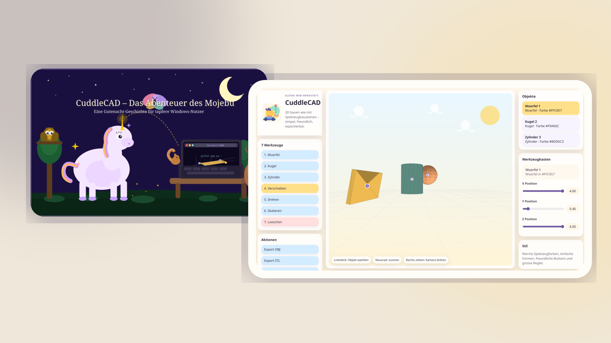

# CuddleCAD
[](https://github.com/sponsors/kevinveenbirkenbach) [](https://www.patreon.com/c/kevinveenbirkenbach) [](https://buymeacoffee.com/kevinveenbirkenbach) [](https://s.veen.world/paypaldonate)


Eine niedliche Browser-Webapp zum einfachen 3D-Modellieren mit 7 Werkzeugen:

1. Wuerfel
2. Kugel
3. Zylinder
4. Verschieben
5. Drehen
6. Skalieren
7. Loeschen

## Guide fuer Einsteiger



Wenn du CuddleCAD lieber Schritt fuer Schritt und in einer verspielten Geschichte einrichten moechtest, lies den illustrierten Guide fuer Windows-Einsteiger:

[Zum Guide](guide.md)

## Schnellstart lokal

```bash
python app.py
```

Dann im Browser oeffnen:

- http://localhost:8000

## Schnellstart mit Docker

```bash
make run
```

oder

```bash
docker compose up --build
```

## Export

Die Webapp exportiert Modelle als:

- OBJ
- STL

## Hinweise

- Fokus ist eine sehr einfache, verspielte Modellier-Webapp.
- Die Bedienung ist absichtlich reduziert.
- Die App ist inspiriert von einer warmen Baustellen-Spielzeug-Optik, ohne direkte Fremdfiguren zu verwenden.
